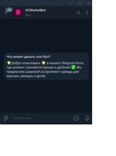
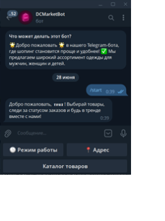
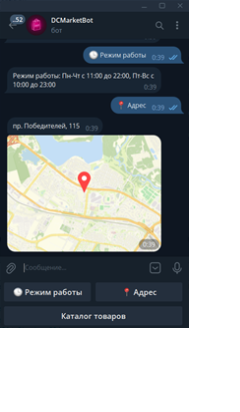
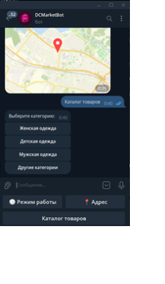
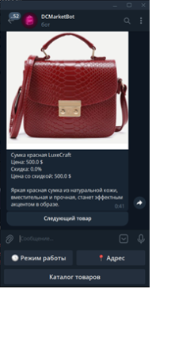

# 🤖 Telegram-бот для интернет-магазина одежды

Этот бот является дополнением к веб-сайту интернет-магазина одежды (https://github.com/vxlana/vasilevskaya2025myitschool).  

Он позволяет пользователям:

- Узнать **режим работы магазина**  
- Узнать **местоположение магазина**  
- Просматривать **каталог товаров** (с данными с сайта)  

Бот реализован с использованием **Aiogram** и интегрирован с существующей базой данных сайта.

---

# 📸 Скриншоты

  

  
  
 
 

---

# ⚙️ Технологии

- Python 3.10+  
- Aiogram 2  
- SQLite / PostgreSQL (совместимо с сайтом)  

---

# 📖 Структура проекта

vasilevskaya2025myitschool_tgbot_dcmarket/
├── .gitignore             
├── config.py      
├── keyboard.py          
├── main.py  
├── user.txt         
└── README.md